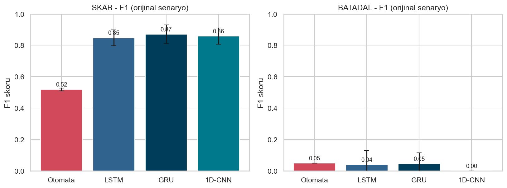
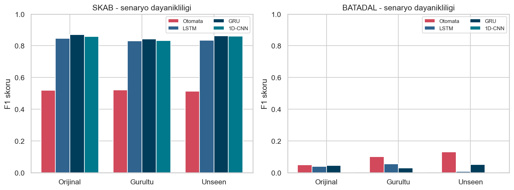
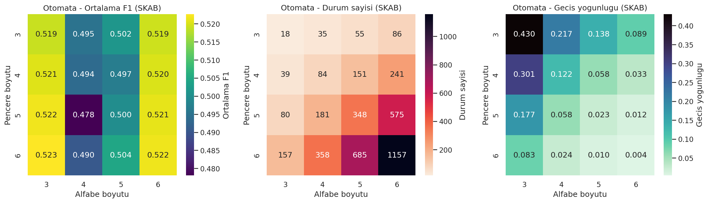
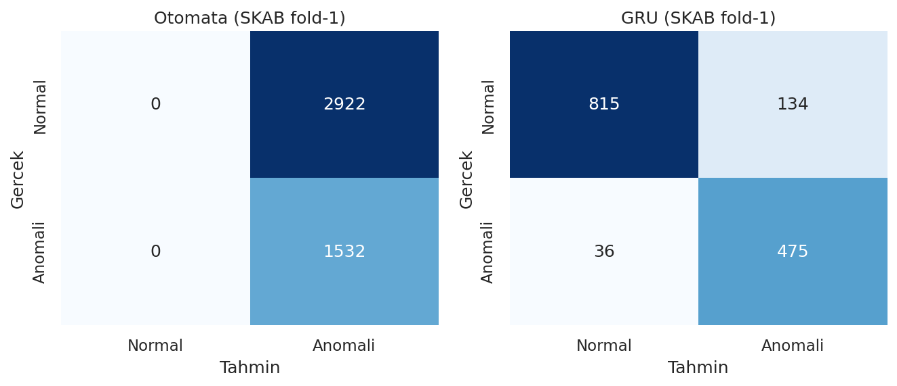
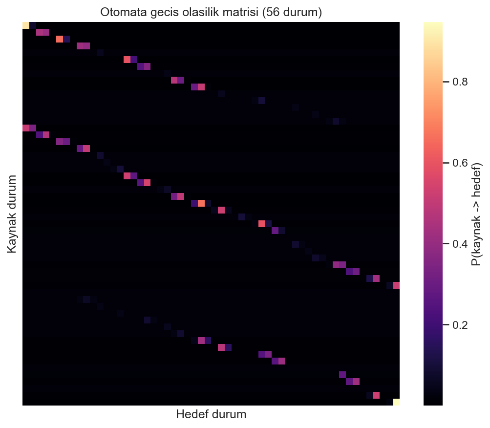
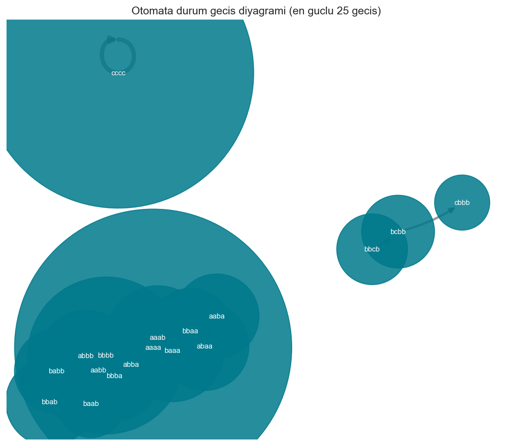

# Kara Kutudan Açıklanabilirliğe: Zaman Serisi Analizi için Olasılıksal Otomatalar

Zaman serisi anomali tespitinde **yorumlanabilir olasılıksal otomata** ile
**kara kutu derin öğrenme** modellerini (LSTM, GRU, 1D-CNN) aynı deney
düzeneğinde karşılaştıran bir çalışmadır. İki gerçek endüstriyel veri seti
(SKAB ve BATADAL) üzerinde doğruluk, gürültü/dağılım kayması dayanıklılığı ve
**açıklanabilirlik** ekseninde bir değerlendirme yapılır.

> Temel soru: Bir modelin yüksek doğruluğu mu yoksa her kararını *neden* verdiğini
> gösterebilmesi mi daha değerli? Bu projede ödünleşim (trade-off) somut sayılarla
> gösterilmektedir.

---

## 1. Motivasyon

Derin öğrenme modelleri zaman serisi anomali tespitinde güçlüdür ama bir
kararın *neden* alındığını gizler. Endüstriyel/güvenlik kritik sistemlerde
"bu nokta neden anomali?" sorusunun yanıtlanabilmesi gerekir. Olasılıksal
otomata, her kararı izlenebilir bileşenlere (durum, geçiş, olasılık, görülmemiş
örüntü cezası) ayırarak **beyaz kutu** bir alternatif sunar. Bu çalışma iki
yaklaşımı dürüst ve sızıntısız bir düzenekte karşılaştırır.

## 2. Veri Setleri

| Veri seti | Satır | Öznitelik | Anomali oranı | Bölme stratejisi |
|-----------|------:|----------:|--------------:|------------------|
| **SKAB** (valve1 + valve2) | 22.472 | 8 | %34,8 | Dosya bazlı `StratifiedGroupKFold` (5 kat) |
| **BATADAL** (dataset04) | 4.177 | 43 | %5,2 | Zaman sıralı %60 / %20 / %20 |

- **SKAB**: <https://github.com/waico/SKAB> — valf test tezgâhında sensör arızaları.
- **BATADAL**: <https://www.batadal.net/data.html> — su dağıtım şebekesine siber saldırılar.
- **Hedef (etiket) sütunları:** SKAB'da `anomaly`, BATADAL'da **`ATT_FLAG`** (`1` = saldırı/anomali → pozitif sınıf; `-999` = normal → `0`). Zaman sütunları (`datetime` / `DATETIME`) ve SKAB'daki `changepoint` / `source_group` / `source_file` yalnızca veri takibi ve dosya bazlı bölme için kullanılır; model girdisine alınmaz.

Veriyi yerinde doğrulamak için: `python -m scripts.download_data`

## 3. Yöntem

### 3.1 Ön İşleme (sızıntı önleme)

Tüm `fit` işlemleri **yalnızca eğitim** bölmesinde yapılır:
`StandardScaler` ve `PCA` eğitim verisine uydurulur, doğrulama/test bu
dönüşümle ölçeklenir. Eksik değerler zaman sıralı doğrusal interpolasyonla
doldurulur. Otomata tek boyutlu girdi istediğinden PCA'nın birinci bileşeni
(**PC1**) kullanılır; derin öğrenme modelleri çok değişkenli ölçeklenmiş
seriyi alır. PC1'in açıkladığı varyans oranı (eğitim bölmesinde): **SKAB ≈ %30,4**
(8 özellik, katlar arası ortalama), **BATADAL ≈ %20,6** (43 özellik). BATADAL'da
tek bileşenin payı düşüktür; bu, otomatanın tek boyuta indirgemesinin BATADAL'da
bilgi kaybına yol açtığını ve düşük başarıya katkıda bulunduğunu gösterir.

### 3.2 Beyaz Kutu — Olasılıksal Otomata

```
PC1 → z-normalizasyon → kayan pencere → PAA → SAX sembolizasyon
    → durumlar (SAX örüntüleri) → frekans tabanlı geçişler
    → Laplace yumuşatmalı geçiş olasılıkları → yol (path) olasılığı
```

- **PAA** (Piecewise Aggregate Approximation): pencereyi segment ortalamalarına indirger.
- **SAX** (Symbolic Aggregate approXimation): Gauss kesim noktalarıyla sembole çevirir.
- Her benzersiz SAX örüntüsü bir **durum**; durumlar arası geçişler frekansla öğrenilir:
  `P(Sᵢ→Sⱼ) = (sayım + α) / (toplam_çıkış + α·|durumlar|)` (Laplace, α=1).
- Bir örüntü dizisinin **yol olasılığı** ardışık geçiş olasılıklarının çarpımıdır;
  düşük olasılık → beklenmedik gidişat → yüksek anomali skoru.
- **Görülmemiş (unseen) örüntü**: eğitim sözlüğünde yoksa **Levenshtein** düzenleme
  mesafesiyle en yakın bilinen örüntüye eşlenir ve mesafe oranında ceza eklenir.

### 3.3 Kara Kutu — Derin Öğrenme

Üç mimari aynı pencereleme (uzunluk 30, adım 3, etiket = pencerenin son adımı)
ve aynı eğitim altyapısıyla kullanılır:

- **LSTM**, **GRU**: son gizli durum → dropout → doğrusal katman.
- **1D-CNN**: iki evrişim katmanı → küresel maksimum havuzlama → doğrusal katman.
- Dengesiz veri için `BCEWithLogitsLoss(pos_weight)`, doğrulama kaybına göre
  erken durdurma, en iyi ağırlıkların geri yüklenmesi.

### 3.4 Açıklanabilirlik

Otomatanın her kararı, makine-okur (JSON) ve insan-okur (Türkçe metin) olarak
gerekçelendirilir: pencere/PAA/SAX değerleri, son geçişler ve olasılıkları, yol
olasılığı, görülmemiş örüntüler + Levenshtein mesafesi, nihai skor/eşik/karar ve
bir güven skoru. Örnek için: `python -m scripts.demo_explain`

## 4. Deney Kurulumu

- **Senaryolar (test anında):** model temiz veriyle bir kez eğitilir, üç koşulda
  değerlendirilir — `orijinal`, `gurultu` (normalize veriye Gauss gürültüsü, σ=0,3),
  `unseen` (×1,8 kazanç kayması → eğitimde görülmemiş örüntüler / dağılım kayması).
- **Tekrarlanabilirlik:** 5 rastgele tohum `[42, 123, 2026, 7, 999]`; otomata
  deterministik olduğundan kat başına bir kez eğitilir.
- **İstatistik:** kat bazlı F1 için **Wilcoxon** işaretli sıra testi; aynı test
  noktalarındaki kararlar için **McNemar** testi.
- Tüm ayarlanabilir parametreler `config/config.yaml` dosyasından yönetilir; kodda
  deney davranışını etkileyen sabit sayı yoktur (tek istisna, sıfıra bölmeyi önleyen
  `1e-8`/`1e-12` gibi matematiksel epsilon sabitleridir).

## 5. Sonuçlar

> Aşağıdaki tüm sayılar `results/` altındaki gerçek deney çıktılarından alınmıştır
> (5 kat × 5 tohum × 3 model + otomata). Yeniden üretmek için: `python -m scripts.run_experiments`

### 5.1 Doğruluk (orijinal senaryo, F1 ortalama ± standart sapma)

**SKAB**

| Model | Accuracy | Precision | Recall | F1 |
|-------|---------:|----------:|-------:|---:|
| Otomata | 0,382 | 0,357 | **0,953** | 0,519 ± 0,009 |
| LSTM | 0,897 | 0,901 | 0,817 | 0,847 ± 0,051 |
| GRU | 0,914 | 0,936 | 0,827 | **0,870 ± 0,059** |
| 1D-CNN | 0,907 | 0,934 | 0,808 | 0,859 ± 0,051 |

**BATADAL**

| Model | Accuracy | Precision | Recall | F1 |
|-------|---------:|----------:|-------:|---:|
| Otomata | 0,813 | 0,048 | 0,050 | **0,049** |
| LSTM | 0,892 | 0,062 | 0,030 | 0,040 ± 0,089 |
| GRU | 0,877 | 0,065 | 0,037 | 0,047 ± 0,068 |
| 1D-CNN | 0,888 | 0,000 | 0,000 | 0,000 ± 0,000 |



- SKAB'da derin öğrenme açık ara önde (F1 ≈ 0,85–0,87 vs otomata 0,52). Otomata
  **yüksek recall (0,95) – düşük precision (0,36)** profiline sahip: anomalilerin
  neredeyse tümünü yakalar ama çok yanlış alarm üretir.
- BATADAL herkes için zordur (küçük, çok dengesiz, eğitim/test dağılımı farklı).
  **1D-CNN F1 = 0'a düşer (seçilen eşikle hiç anomali işaretlemez)**; üstelik
  `roc_auc ≈ 0,05` (5 tohum ort.) salt çoğunluk-sınıfı çöküşünden (≈ 0,50)
  belirgin biçimde düşüktür — yani skorlar **sistematik olarak ters sıralanmış**:
  ağ gerçek anomalilere düşük skor verir (dağılım kayması altında dejenere eğitim).
  Otomata (F1 = 0,049) ve GRU (0,047) benzer düzeyde düşük kalır.

### 5.2 Dayanıklılık (senaryolar arası F1)

| Veri | Model | Orijinal | Gürültü | Unseen |
|------|-------|---------:|--------:|-------:|
| SKAB | Otomata | 0,519 | 0,522 | 0,513 |
| SKAB | GRU | 0,870 | 0,842 | 0,863 |
| SKAB | 1D-CNN | 0,859 | 0,833 | 0,860 |
| BATADAL | Otomata | 0,049 | 0,101 | **0,130** |
| BATADAL | 1D-CNN | 0,000 | 0,000 | 0,000 |



- Otomatanın F1'i gürültü ve dağılım kayması altında neredeyse **sabit** kalır
  (SKAB'da 0,51–0,52). Bu, frekans tabanlı örüntü modelinin küçük bozulmalara
  dayanıklı olduğunu gösterir.
- BATADAL'da `unseen` senaryosunda **otomata tüm modeller arasında en iyidir
  (0,130)** — görülmemiş örüntüleri Levenshtein ile ele alma yeteneği burada işe yarar.

### 5.3 Parametre Duyarlılığı (otomata, SKAB)

Pencere boyutu × alfabe boyutu taraması; en iyi sonuç **alfabe = 3** sütununda
toplanır (window 3–6 arası F1 ≈ 0,518–0,520; pratikte stabil).



### 5.4 İstatistiksel Testler

- **Wilcoxon (SKAB, kat bazlı F1):** otomata vs LSTM/GRU/1D-CNN için p = 0,0625
  (n = 5; bu, 5 katta tutarlı yönlü farkın ulaşabileceği en küçük p değeridir).
  Derin öğrenme tüm katlarda otomatadan yüksektir.
- **McNemar (SKAB, otomata vs 1D-CNN):** istatistik = 3061,8, p ≈ 0; yalnız
  otomatanın doğru olduğu 508 nokta, yalnız 1D-CNN'in doğru olduğu 4376 nokta —
  SKAB'da derin öğrenme net üstün.
- **McNemar (BATADAL):** istatistik = 21,3, p = 3,9·10⁻⁶. Burada ham *doğruluk*
  her şeye "normal" diyen 1D-CNN'i kayırır; oysa F1 otomatanın az da olsa gerçek
  anomali yakaladığını, 1D-CNN'in hiç yakalamadığını gösterir. **Dengesiz veride
  accuracy yanıltıcıdır; asıl ölçüt F1/PR'dir.**



## 6. Açıklanabilirlik Örneği

`scripts/demo_explain.py` çıktısından gerçek bir karar (SKAB, konum 2274):

```
Durum (SAX) : cbcb
Yol         : bacb -> acbc -> cbcb
Skor / Eşik : 9.188 / 0.218  ->  Karar: ANOMALİ (güven 1.00)
Açıklama    : Son 2 geçişin yol olasılığı 2.781e-04 (düşük olasılık = beklenmedik
              gidişat). 1 geçiş eğitimde görülmemiş örüntü içeriyor; örneğin 'acbc'
              en yakın bilinen 'aabc' örüntüsüne Levenshtein=1 uzaklığında, toplam
              +1.0 ceza eklendi. Toplam skor 9.19 eşiği (0.22) aştığı için ANOMALİ.
```

Derin öğrenme modelleri bu tür bir gerekçe **üretemez**; projenin temel katkısı
budur. Otomatanın iç yapısı da görselleştirilebilir:

| Geçiş olasılık matrisi | Durum geçiş diyagramı |
|---|---|
|  |  |

## 7. Kurulum ve Çalıştırma

```bash
# 1) Bağımlılıklar
pip install -r requirements.txt

# 2) Veri kontrolü (data/ altında SKAB ve BATADAL hazır olmalı)
python -m scripts.download_data

# 3) Birim testler
pytest -q

# 4) Tüm deneyler (5 kat × 5 tohum + parametre taraması, ~9 dk)
python -m scripts.run_experiments
#    Hızlı duman testi için:  python -m scripts.run_experiments --hizli

# 5) Figürler ve açıklanabilirlik demosu
python -m scripts.make_figures
python -m scripts.demo_explain
```

Çıktılar `results/` altına yazılır: `olcumler.csv`, `ozet.csv`,
`istatistik_testleri.json`, `parametre_taramasi_skab.csv`, `figurler/`, `aciklamalar/`.

## 8. Proje Yapısı

```
config/config.yaml          Tüm parametreler (tek kaynak)
src/
  preprocessing/            Veri yükleme, ölçekleme/PCA, bölme, gürültü
  models/
    base.py                 AnomaliModeli arayüzü, ModelGirdisi
    automata/               PAA, SAX, Levenshtein, otomata, otomata modeli
    deep_learning/          LSTM/GRU/1D-CNN ağları, veri kümesi, eğitici, model
  explainability/           Karar açıklayıcı (JSON + Türkçe metin)
  experiments/              Metrikler, istatistik testleri, senaryolar, koşturucu
  utils/                    Konfig, segmentler, eşik, tohumlama
scripts/                    run_experiments, make_figures, demo_explain, download_data
tests/                      Birim testler (Levenshtein, PAA, SAX, otomata)
results/                    Deney çıktıları, figürler, açıklamalar
```

## 9. Tasarım İlkeleri

- **SOLID/OOP:** koşturucu somut modellere değil `AnomaliModeli` arayüzüne bağımlıdır;
  yeni model eklemek için yalnızca fabrika genişletilir (açık/kapalı ilkesi).
- **Sızıntı yok:** tüm `fit` işlemleri yalnızca eğitim bölmesinde.
- **Tekrarlanabilirlik:** sabit tohumlar, merkezî konfig; kodda yalnızca matematiksel
  epsilon sabitleri kalır, ayarlanabilir parametreler config'tedir.
- **Dürüst sonuç:** tüm tablolar gerçek deney çıktısıdır; yer tutucu/uydurma değer yoktur.

## 10. Özet Bulgu

Doğrulukta derin öğrenme (özellikle SKAB'da) üstündür; ancak otomata **gürültü ve
dağılım kaymasına dayanıklı**, **görülmemiş örüntülerde rekabetçi** ve en önemlisi
**her kararı açıklanabilir**dir. Çalışma, *yorumlanabilirlik–doğruluk ödünleşimini*
gerçek veriyle somut biçimde ortaya koyar.
